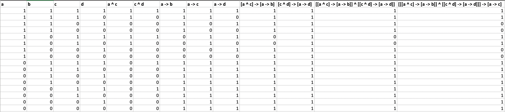

# Logic Calculator

## Building and Running
To build this program first navigate to the project directory. For example:

```console
cd ~/Documents/GitHub/LogicCalculator
```

Then make a new directory called build:

```console
mkdir build
```

Then navigate into the new build directory and run the following commands:

```console
cd build
cmake ..
make
```

After, to execute, do this command in the terminal.

```console
./LogicCalculator
```

The terminal will then prompt for a logical statement to create a truth table from. 
Please use paranthesis for each logical component to explicity separate the left and right sides. 

For example, instead of

```console
(a ^ c) -> (a -> b) ^ (c ^ d) -> (a -> d) -> (a -> c)
```
Use extra paranthesis to explicity show each statement.
```console
(((a ^ c) -> (a -> b)) ^ ((c ^ d) -> (a -> d))) -> (a -> c)
```

For the union operator, use a 'v' symbol. 

For the intersection operator, use a '^' symbol.

For the if-then/conditional operator, use '->'.

## About

This program takes an input of a string from a terminal input and creates a truth table for the statement. 
It parses each specific statement recursively and adds them to a map.
From there, using simple computer logic, each individual portion of the statement creates a huge truth table that spans the entire statement.

One of the key parts of this Discrete Math course was the logical portion of it. Computers are complicated systems that require a lot of calculation and logical rules.
Without them, they are just piles of silicon and glass. In our project, we break down these logical rules and show the behind the scenes that connect these complex symbols with ones and zeroes.
Union, intersection, and conditional operators are basic, combining two variables at a time.
However, when stacked up one after another, they can represent very complicated logical systems.

What is important about this project is its step-by-step method of parsing and understanding each logical statement.
This is helpful for several real-world applications.
One of which is in computer engineering, where the building of a computer relies on the outstanding mathematical rules of logical chips.
Connecting the inputs of the chips (much like connecting each of these statements) can represent extremely complex mathematical systems.
These chips operate with electricity to manipulate bits and represent numbers.

This project could prove extremely useful when creating computers.
Specifically, when building a computer from the ground up, creating logically correct chips are crucial to ensure the completeness of a computing system.
Since they are the building blocks of any computing system, chips are relatively basic to begin with.
Even then, they can be extremely difficult to comprehend when putting together.
Take for instance a CPU chip, which is a combination of several, And, Or, Mux, and Register chips.
That single CPU chip is a combination of a multitude of other chips and represents a core part of a computer.
Even simple operations like adding and subtracting rely on the logical standing of these chips.
Being able to visually represent all the outcomes of these chips through a truth table can be very beneficial in both software and hardware developments.

In conclusion, our project is a developer tool to help computer engineers.
While it seems simple, creating a truth table from these complex statements posed a significant logical challenge that can represent both computer chips and algorithmic logic.
Being able to plan out and see all of the possible outcomes of a certain statement can help plan how a chip will manipulate certain computer systems.
Truth tables are a great way to depict the diverse and complicated logical ideas that comprise a computing system.


## Example
Take for example this input:
```console
(((a ^ c) -> (a -> b)) ^ ((c ^ d) -> (a -> d))) -> (a -> c)
```

The produced output in output.csv is like this:


Each row is a specific breakdown of the statement starting from the singular characters to the final full-length statement.
In this table, a '1' represents True (on bit) and a '0' represents False (off bit).